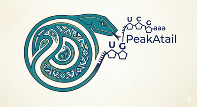

# PeakATail Hub — Visual Design System

**Status:** adopted · **Owner:** design-system · **Tokens:** `frontend/src/app/theme/tokens.css`

This is the shared visual language for peakatail-hub. Three teams build against it
(geneview, dashboard, shell). **You import the tokens; you do not redefine their
values.** New tokens go in `tokens.css`, never inline hex.

---

## The mark



`frontend/public/brand/peakatail_logo_full.png` (+ `peakatail_logo.png` 400px,
`peakatail_logo_sm.png` 160px, `favicon.png` = snake head). An ornate
**teal-and-gold coiled snake** whose tongue becomes an **RNA backbone**
(U-C-G… ending in a poly-A tail — the "PeakATail" pun), with a **deep-navy
wordmark** on **cream paper**. The whole design system is anchored to this mark:
**teal on cream, navy ink, gold accents.** Colors are sampled directly from the
full-res logo — we do not invent a palette.

Place the logo (`peakatail_logo_sm.png`) as the brand mark in the top-left of the
top bar, next to the `.brand-wordmark`.

## 0. North star

peakatail-hub is a **scientific genome-browser tool wearing the PeakATail brand** —
not a dark admin dashboard. The interaction references are IGV / igv.js, UCSC
Genome Browser, and JBrowse 2 (light, restrained, information-dense: coordinate
ruler on top, track labels in a left gutter, quiet chrome so the *data* carries
the color). The *visual identity* is the logo: **teal primary, navy text, gold
highlights, cream paper.**

The GeneView must read like the packaged figure
`reports/figures/geneview_CLIC2_3pas.png`: **light (warm-paper) track canvas,
petrol/steel isoform models, warm-grey introns with strand arrows, terracotta PAS
bands, viridis proportion bars, a viridis colorbar.** Viridis is reserved for data.

Two hard rules that shape everything:

1. **Tables stay first-class readable views.** Spreadsheets are not a lesser
   citizen — only the *GeneView* tab is the IGV-style browser. Columns size to
   content; **no default truncation.**
2. **The track canvas is always light**, in both light and dark chrome themes.

### What was wrong with the old UI (diagnosis)

Screenshotting the running app surfaced the exact failure modes to fix:

- **Generic dark-admin skin** (`#0f1115` page, `#5b9dff` SaaS-blue accent) — reads
  like every bootstrapped internal tool, nothing scientific about it.
- **Every table column truncated** to `cl_…`, `ENS…`, `short…`, `tand…`. The
  single most important data view was unreadable. This is the #1 fix.
- **Cramped, undifferentiated chrome** — 52px top bar, flat 160px nav, no visual
  hierarchy between chrome and canvas, numbers in a proportional sans (misaligned).
- **GeneView was a dashed-border stub**, not a track browser.

---

## 1. Theme model

- **Cream/light-first.** Default theme is the brand's cream paper with teal
  primary and navy ink — matching IGV/UCSC/JBrowse's lightness *and* the logo.
  This is the biggest single lever away from "generic dark-admin."
- **Dark is a cheap re-skin of chrome only**, re-toned as **deep petrol-navy** so
  it stays on-brand. Enabled by `prefers-color-scheme` or
  `:root[data-theme="dark"]`. The **track-canvas tokens are not overridden** in
  dark — the GeneView stays light so it keeps matching the figure.
- All colors are semantic tokens sampled from the logo. Never hardcode hex.

---

## 2. Color — the brand palette

Sampled from `peakatail_logo_full.png`. Four brand colors: **cream, teal, navy,
gold.**

### Chrome (cream / light theme)

| Token | Value | Use |
|---|---|---|
| `--bg-page` | `#f5f2e6` (cream) | app background behind panels |
| `--bg-surface` | `#fdfcf6` (light cream) | cards, panels, table body |
| `--bg-raised` | `#fdfcf6` + `--shadow-pop` | popovers, dropdowns, search results |
| `--bg-sunken` | `#ece7d4` | wells, sticky table headers, track stack bg |
| `--bg-hover` | `#ece7d4` | row / item hover |
| `--line` | `#ddd6c0` (warm) | default hairline border |
| `--line-strong` | `#cbc3a8` | emphasized dividers, header underline |
| `--line-faint` | `#e8e3d2` | inner grid lines, row separators |
| `--ink` | `#1e2a55` (navy) | headings, primary text, wordmark |
| `--ink-body` | `#2c3457` (navy) | body text |
| `--ink-muted` | `#5b6178` | labels, secondary, column headers |
| `--ink-faint` | `#8f8d86` | placeholders, disabled |

### Primary — brand teal / petrol (from the snake)

| Token | Value | Use |
|---|---|---|
| `--accent` | `#0d7a7d` (teal) | active nav, primary buttons, links, selection, form controls |
| `--accent-strong` | `#00607a` (petrol) | hover/pressed accent |
| `--accent-tint` | `rgba(13,122,125,.10)` | active row/tab background |
| `--focus-ring` | 3px `rgba(13,122,125,.35)` | keyboard focus |

Native form controls (checkbox/radio/range) get `accent-color: var(--accent)`
globally — no more browser-default blue.

### Secondary — brand gold / sand (from the filigree)

| Token | Value | Use |
|---|---|---|
| `--gold` | `#c8a24a` | highlight marks, gold accent chips, emphasis rules, active-data underlines |
| `--gold-strong` | `#8a6d2c` | gold **text** on cream (contrast-safe) |
| `--gold-tint` | `rgba(200,162,74,.16)` | gold highlight background |

> Gold is an **accent, not a workhorse** — use it for highlights, the occasional
> KPI emphasis, "pinned"/starred marks, section rules. Body text and primary
> actions are navy/teal. `--gold` (`#c8a24a`) is too light for text on cream — use
> `--gold-strong` when gold must carry a label.

### Status — tuned for the cream surface

| Token | Value | Use |
|---|---|---|
| `--warn` / `--warn-tint` | `#b7791f` | caveat badges (pseudoreplication, low n) |
| `--danger` / `--danger-tint` | `#b3261e` | errors, retracted findings |
| `--ok` / `--ok-tint` | `#2f7d5b` | pass / confirmed |
| `--info` / `--info-tint` | `#5b4b9e` | neutral informational notes |

Warn (`#b7791f`) is deliberately more orange than the brand gold so a caveat never
reads as decorative gold.

Caveats are a **first-class recurring concept** in this app (fisher
pseudoreplication, nb_multi double-dipping, atlas-snapping filters). They render
as **warn badges** with a tooltip, never as silent omissions.

### Data encodings (the color that carries meaning)

- **Isoform models (DATA marks, true to the figure):** `--track-model-exon` =
  `--isoform-blue` `#2f6f9f` — the CLIC2 figure's steel-blue exon boxes. **This is
  the one place steel-blue lives, and it is a data color, never chrome.** Stroke
  `--track-model-stroke` `#1e2a55` (navy), introns `--track-model-intron` `#a49c88`
  (warm neutral, echoes the filigree grey), highlighted isoform/exon
  `--track-model-hi` `#3d84d6` (figure-accurate bright blue).
- **PAS bands:** fill `--pas-band-fill` (translucent terracotta), guide line
  `--pas-band-line`, uid label `--pas-label` `#b3392a`.
- **Within-gene proportion (viridis):** use `--viridis-ramp` for the colorbar and
  the `--viridis-NN` stops (`00,15,30,45,60,70,82,92,100`) for bars. **Viridis is
  reserved for proportion/usage** — never decorate chrome with it.

Viridis is perceptually uniform but **not colorblind-distinct at the endpoints for
categorical use** — only ever map it to the continuous 0→1 proportion, and always
pair it with the numeric % label (as the figure does).

---

## 3. Typography

| Token | px | Use |
|---|---|---|
| `--fs-micro` | 11 | caveat lines, footnotes, axis ticks |
| `--fs-small` | 12 | dense tables, chips, track labels |
| `--fs-body` | 13 | default UI body |
| `--fs-base` | 14 | comfortable body |
| `--fs-title` | 16 | card / panel titles |
| `--fs-h2` | 20 | view titles |
| `--fs-h1` | 24 | page title |

- **Sans:** `--font-sans` (Inter → system). Weights: 400 body, 500 labels,
  600 headings/emphasis.
- **Mono:** `--font-mono` (JetBrains Mono → `ui-monospace`). Used for **all
  numbers, genomic coordinates, and IDs** (ENSG/ENST/pas_uid/barcode).
- **Tabular numerals everywhere numbers line up.** Apply `.num`
  (`font-variant-numeric: tabular-nums lining-nums`, right-aligned) to numeric
  cells. This is non-negotiable for q-values, deltas, positions, counts — it's
  what makes a scientific table scannable.

---

## 4. Space, radius, elevation, motion

- **Space:** 4px rhythm — `--space-1…9` = 2, 4, 6, 8, 12, 16, 24, 32, 48.
- **Radius:** `--radius-sm` 3 · `--radius-md` 5 (default) · `--radius-lg` 8 ·
  `--radius-xl` 12 · `--radius-pill`. Keep radii **tight** — scientific tools read
  as precise, not soft.
- **Elevation:** `--shadow-1` (cards), `--shadow-2` (raised), `--shadow-pop`
  (dropdowns/search). Light theme uses *subtle* shadows + hairline borders, not
  heavy drop shadows.
- **Motion:** `--dur-fast` 120ms / `--dur` 180ms, `--ease`. Micro-interactions
  only (hover, focus, expand). No decorative animation on data.

---

## 5. Component specs

### 5.1 Search bar (location / gene / pas_uid / barcode)

The primary entry point, modeled on the genome-browser location box.

- Full-width in the top bar, `max-width: 520px`, `--bg-surface`, `--line` border,
  `--radius-md`, mono placeholder `search gene · ENSG · pas_uid · chrX:155,277,212`.
- **Accepts and routes four query shapes**, detected by pattern:
  `gene symbol` → gene, `ENSG…/ENST…` → gene, `pas_uid` → PAS, `chr:pos` →
  locus, `barcode` → cell.
- Results dropdown = `--bg-raised` + `--shadow-pop`, grouped by entity type with a
  small type label; each row shows the **primary id (mono)** + a secondary
  descriptor (gene name, cluster, coords). Keyboard: ↑/↓, Enter, Esc.
- Focus shows `--focus-ring`. Never truncate the matched id.

### 5.2 Readable tables (Findings / Browse — first-class views)

**The core fix. Columns size to content; no default ellipsis.**

- Use the global `.data-table` base. Header sticky on `--bg-sunken`, underlined
  with `--line-strong`. **Horizontal rules only** (`--line-faint`) between rows —
  recommended for dense data over a full grid.
- **Text left-aligned, numbers right-aligned with `.num`** (tabular mono). Decimal
  points line up; q=0.0100 sits under q=0.8000.
- **Column sizing:** give real widths. IDs (`ENSG…`, `pas_uid`) get their natural
  mono width via `.col-id` and `white-space: nowrap`. Categorical columns
  (strategy, celltype, direction, utr_class) size to their longest label —
  `fisher`, `nb_pairwise`, `lengthening`, `tandem_3utr` must show in full.
- **Truncation is opt-in per column only** (`.truncate` + a `title` tooltip),
  reserved for genuinely unbounded free-text. It is never the table default.
- **Density is a user setting** — offer compact / comfortable row height and
  persist it. Default comfortable (`--space-3` padding).
- **Caveat badges inline**: a `q` derived from pseudoreplicated fisher shows a
  `--warn` badge in the cell or a trailing flag column — the number is never shown
  bare when it carries a known validity caveat.
- Horizontal scroll lives **inside the table wrapper** (`overflow:auto`), never the
  page body. Header row stays sticky.

### 5.3 Entity browsers (genes / PAS / cells)

- Left **facet rail** (`--bg-surface`, `--line`) with labeled selects/inputs
  (`--ink-muted` labels, mono where values are numeric thresholds).
- Right = a `.data-table`. Selecting a row opens the **detail panel** and, for a
  gene, links to the GeneView tab.
- Result count + active filters shown as removable chips above the table.

### 5.4 Dashboard cards (overview / run cards / sources)

- `.panel` on `--bg-surface`, `--shadow-1`, `--radius-lg`, `--space-6` padding.
- Card title `--fs-title` `--fw-semibold`; one **big tabular metric** per stat
  (`.num`, `--fs-h2`) with a `--ink-muted` caption beneath.
- Run cards: status dot (`--ok`/`--warn`/`--danger`), run id (mono), dataset,
  n_cells / n_genes / n_pas as tabular stats, and a quiet "open" affordance.
- Never use viridis or heavy color here — dashboards stay neutral; color is saved
  for the data canvas.

### 5.5 App shell (IGV-style, browser-central)

- **Top bar** (`--bg-surface`, `--line` bottom): brand → search (flex) → scope/run
  combobox → pins → settings/theme. Give it a touch more height (`56px`) and
  breathing room than the old 52px cramped bar.
- **Left nav** = quiet vertical list; active item uses `--accent` left-border +
  `--accent-tint` bg + `--ink`. Sections: Dashboard, Findings, Browse
  (Genes/PAS/Cells), **GeneView**, UMAP, QC, Audit, Compare.
- **Detail panel** (right) is contextual — entity id (mono), key facts as a small
  definition list, caveats as badges, pin action.
- Chrome recedes; the main canvas is the loudest surface.

### 5.6 Badges

`.badge` + `--warn` / `--danger` / `--ok` / `--accent` / `--neutral`. Pill,
`--fs-micro`, semibold. The vocabulary for caveats, statuses, and counts.

---

## 6. GeneView visual spec (the IGV-style browser)

Match `reports/figures/geneview_CLIC2_3pas.png`. The GeneView is a **vertical stack
of horizontally-aligned tracks** sharing one genomic x-axis, with a **left label
gutter** and a **coordinate ruler**.

```
┌────────────────────────────────────────────────────────────────────────────┐
│  Gene CLIC2 (ENSG00000155962) · chrX:155,277,212–155,287,685 · − · 58.4 kb · 3 PAS   ← title (mono coords)
├──────────────┬─────────────────────────────────────────────────────┬───────┤
│  [ label     │        coordinate ruler  3.8   13.8   23.8 … (kb)     │       │  ← --track-ruler-h, --track-ruler-bg
│   gutter ]   ├─────────────────────────────────────────────────────┤       │
│  Isoforms    │  ▮──◄──▮──────◄─────▮────◄────▮   ENST00000491205    │       │  ← model rows, --track-model-row
│              │  ▮──◄──▮──────◄─────▮────◄────▮   ENST00000321926    │       │
│              │   ░15542    ░15543   ░15544  ← PAS bands span all tracks       │
│  ────────────┼─────────────────────────────────────────────────────┤   ▮   │
│  cluster 0   │        ▐100%                                          │   ▮ v │  ← proportion track, --track-prop-row
│  (n=119)     │                                                       │   ▮ i │
│  cluster 1   │   ▐32%  ▐68%                                          │   ▮ r │
│  (n=159)     │                                                       │   ▮ i │
│     ⋮        │                                                       │   ▮ d │  ← viridis colorbar 0→1
│  cluster 7   │              ▐100%                                    │   ▮ i │
│  (n=51)      │                                                       │   ▮ s │
├──────────────┴─────────────────────────────────────────────────────┴───────┤
│              Distance from gene start (kb) — anchor chrX:155,276,210          │  ← x-axis label
└────────────────────────────────────────────────────────────────────────────┘
```

### Layout tokens

- `--track-canvas` warm near-white paper surface (`#fdfcf7`); `--track-well` for the recessed stack; the whole
  browser sits in a `.panel`.
- `--track-label-col` = 136px left gutter. Labels right-aligned, `--fs-small`,
  `--track-label` color: `Isoforms`, `cluster 0 (n=119)` (n in `--ink-muted`).
- `--track-ruler-h` 26px ruler with `--track-tick` ticks + `--fs-micro` mono
  numbers; faint `--track-grid` verticals drop through every track for alignment.
- `--track-model-row` 22px per isoform; `--track-prop-row` 52px per cluster;
  `--track-gap` 2px between tracks (tight stack, as in the figure).
- One shared x-scale across all tracks. Genomic coordinates in mono.

### Track content

- **Isoform models:** exons = `--track-model-exon` rounded blocks with
  `--track-model-stroke`; introns = 1px `--track-model-intron` line with periodic
  **strand arrows** (`◄` on − strand). The active/annotated isoform or exon uses
  `--track-model-hi`. ENST id at the row's right edge (mono, `--ink-muted`).
- **PAS bands:** vertical translucent columns (`--pas-band-fill`, width
  `--pas-band-w` 8px) spanning the **full track stack**, with a `--pas-band-line`
  center guide and a `--pas-label` (`#c0392b`) uid number at the top
  (`15542`,`15543`,`15544`). They visually tie every cluster's bars back to a PAS.
- **Proportion tracks (per cluster):** a thin bar at each PAS position; **bar
  height = within-gene proportion**, **bar fill = viridis(proportion)** — height
  and color both encode the same value, exactly as the figure. The `%` label sits
  above each bar in `--fs-micro`. Baseline = `--track-baseline`.
- **Viridis colorbar** on the right, `--track-colorbar-w` 14px, `--viridis-ramp`,
  labeled `Within-gene proportion` 0→1.
- **Selection/hover:** hovering a PAS band or bar lifts `--highlight-band` across
  the stack and surfaces a tooltip (pas_uid, position, cluster, n, proportion).

### Chrome the GeneView needs (from the browser references)

- Location/search box (shared top-bar search routes here), zoom in/out + fit
  buttons, and the gene span shown as `chr:start–end · strand · length · N PAS`.
- Coordinate ruler top; left label gutter; tracks aligned to one ruler — the three
  invariants every genome browser shares.

---

## 7. Accessibility

- Body/label text ≥ 4.5:1 on its surface; `--ink-muted` on `--bg-page` verified.
  Never encode state by **color alone** — pair viridis with the % label, pair
  status with a badge shape/text.
- Every interactive element gets `--focus-ring` via `:focus-visible` (global).
- Keyboard: search (↑/↓/Enter/Esc), table rows focusable, nav is a real list.
- Tooltips supplement, never replace, on-canvas labels.

---

## 8. Adoption checklist (for the three teams)

- [ ] Import tokens only; zero inline hex. New token → `tokens.css`.
- [ ] All numbers use `.num` / tabular mono; IDs & coordinates are mono.
- [ ] Tables use `.data-table`; columns size to content; **no default truncation**.
- [ ] Caveats render as `--warn` badges, never dropped silently.
- [ ] Viridis only for within-gene proportion; chrome stays neutral.
- [ ] GeneView track canvas stays light in both themes and matches CLIC2.
- [ ] Focus rings visible; state never conveyed by color alone.

---

### References

- JBrowse 2 — Linear Genome View UI anatomy (ruler, track labels, location box,
  zoom): <https://genomebiology.biomedcentral.com/articles/10.1186/s13059-023-02914-z>
- igv.js — embeddable genome viewer, ruler + toggleable track labels:
  <https://github.com/igvteam/igv.js/>
- Data-table best practice (right-aligned tabular numerals, horizontal rules,
  density as a user setting, no truncation):
  <https://www.pencilandpaper.io/articles/ux-pattern-analysis-enterprise-data-tables>
